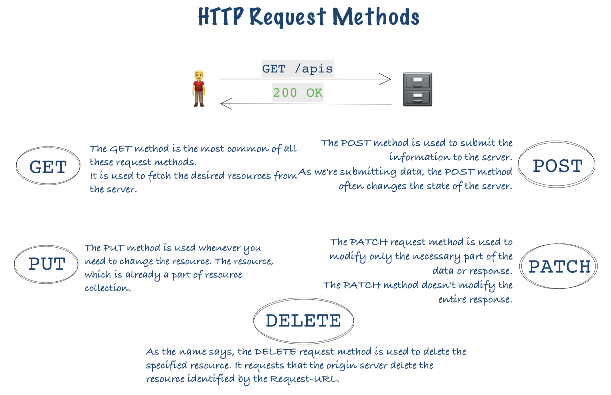
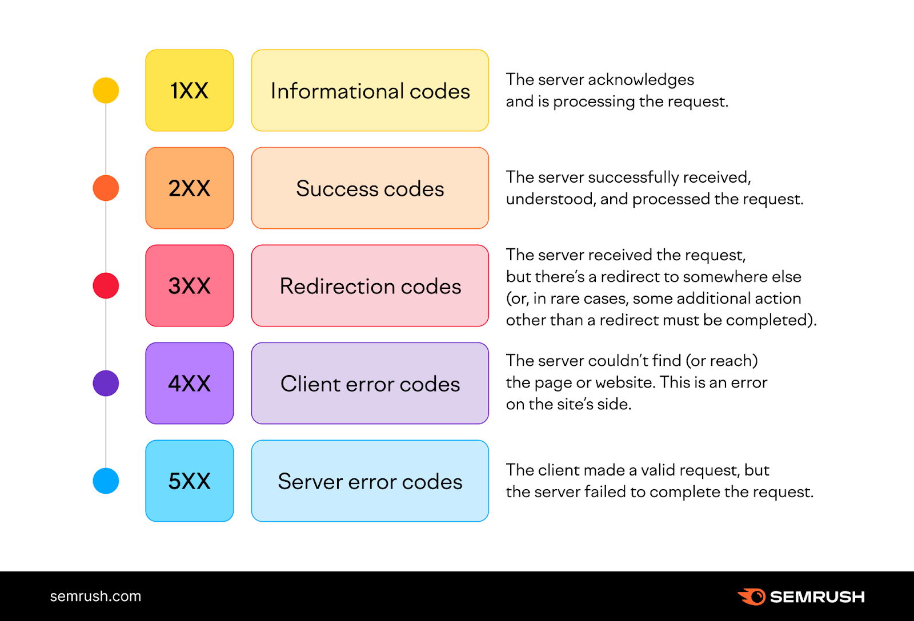

# Github-JIRA intergration Project - (Part-2)

# Http request methods

# Http Status codes

 
1xx – Informational Response (These status codes are all about the information received by the server when a request is made). 
2xx – Success (This status code depicts that the request made has been fulfilled by the server and the expected response has been achieved). 
3xx – Redirection (The requested URL is redirected elsewhere). 
4xx – Client Errors (This indicates that the page is not found). 
5xx – Server Errors (A request made by the client but the server fails to complete the request).  

https://www.geeksforgeeks.org/10-most-common-http-status-codes/
